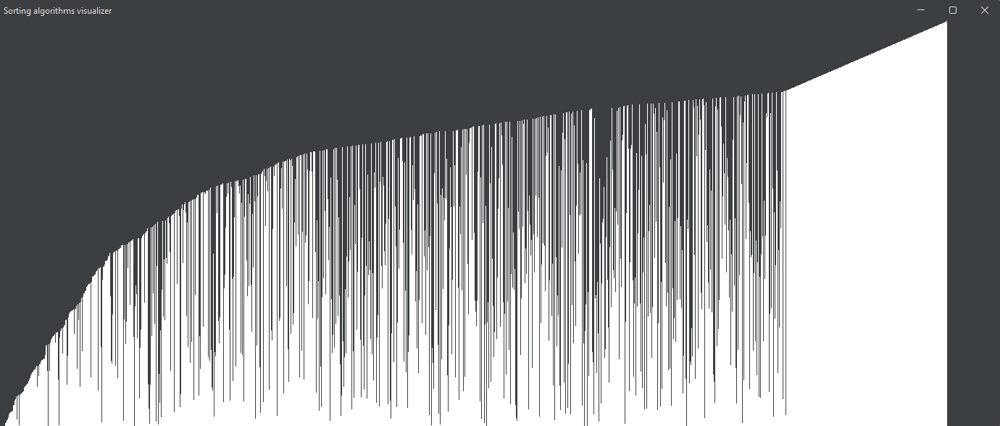

# Sorting Algorithm Visualizer
This small Java Swing application presents the way different sorting algorithms work in an animated format for better understanding.

## Currently implemented sorting algorithms:
- [x] Bubblesort
- [x] Selection sort
- [x] Insertion sort
- [x] Quicksort 
